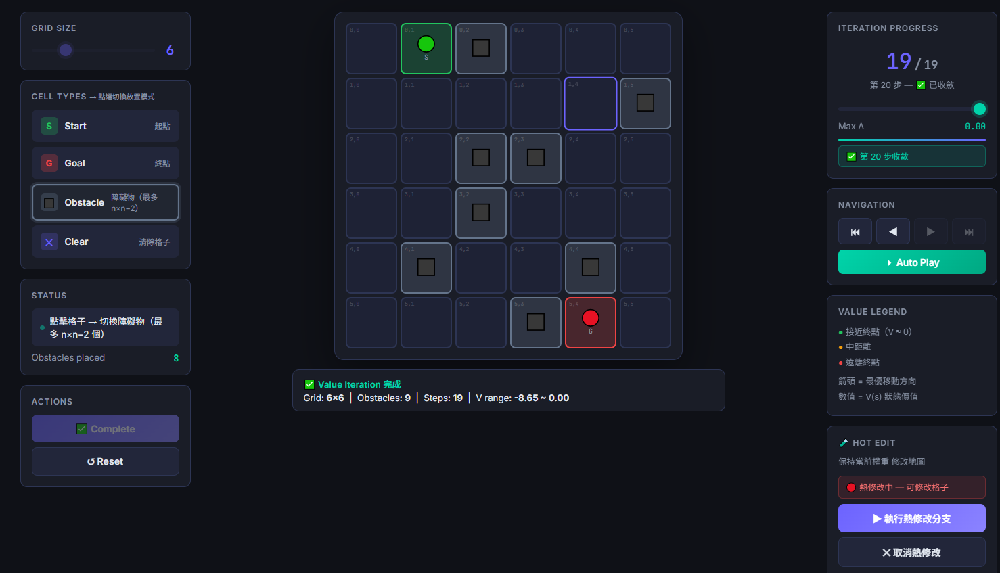

# DRL HW1 — Grid World Policy Evaluation

> **Course**: Deep Reinforcement Learning HW1  
> **Author**: [g114056175](https://github.com/g114056175)  
> **Develop with Antigravity**: [conversation.log](https://github.com/g114056175/DRL_hw1/blob/main/conversation.log)

---

## 📌 Overview

An interactive **nxn Grid World** web application built with **Flask** and purely Vanilla JS/HTML/CSS for the frontend.

| Feature | Description |
|---------|-------------|
| **Interactive Grid** | Dynamic grid dimensions UI with Start, Goal, and Obstacle placements. |
| **Value & Policy Iteration** | Step-by-step playback of the Value Iteration and Policy Iteration (RL) propagation process. |
| **Randomize Policy** | Generate a random initial policy (arrows) to start with. |
| **Historical Playback** | Use a slider to scrub back and forth through steps with accurate map states. |
| **Hot Edit Branching** | Pause at any iteration step, modify the obstacles/targets, and recalculate to branch off new trajectories. |

---

## 🚀 Live Demo

> **[Live Demo](https://huggingface.co/spaces/g114056175/DRL-hw1-demo)** *(Deployed on Hugging Face Spaces)*

---

## 📸 Screenshots

| 1. User Configuration | 2. Initialization |
|:---:|:---:|
|  |  |
| *Setting grid size and placing elements* | *Initial state at Step 0* |

| 3. Intermediate State | 4. Normal Result (Convergence) |
|:---:|:---:|
|  |  |
| *Value propagation during iterations* | *Final optimal policy and V-values* |

| 5. Hot Edit Mode | 6. Branch Result |
|:---:|:---:|
|  |  |
| *Modifying map while keeping weights* | *New convergence after modified map* |

---

## 🖥️ Features

### HW1-1 — Grid Map
- Slider to select **grid size n** (5 ~ 9)
- Click cells to assign roles:
  - 1st click → **Start** (green 🟢)
  - 2nd click → **Goal** (red 🔴)
  - Further clicks → **Obstacles** (gray, max = n−2)
  - Re-clicking a cell removes it
- Visual feedback: dark-theme UI with smooth animations

### HW1-2 — Value Iteration & Playback Controle
- Press **Start Value Iteration** to:
  1. Initialize with an empty value state array.
  2. Run **Value Iteration** to compute the optimal path (Bellman Optimality Equation).
  3. Store the entire progression history in memory.
- Use the **Right Panel** to:
  - Slide through iterations visually step-by-step.
  - Auto-play or scrub manually.
  
### **🧪 Hot Edit Branching**
- Pause at *any* intermediate step, hit **Hot Edit**.
- Clear/Add obstacles seamlessly, hit **Run Branch**.
- The algorithm will preserve the V-values computed up to that point, recalculate, and branch the timeline, appending new steps automatically.

---

## 🛠️ Installation & Running

```bash
# 1. Clone repo
git clone https://github.com/g114056175/DRL_hw1.git
cd DRL_hw1

# 2. Create virtual environment (optional but recommended)
python -m venv venv
venv\Scripts\activate      # Windows
# source venv/bin/activate  # Linux/Mac

# 3. Install dependencies
pip install -r requirements.txt

# 4. Run Flask server
python app.py
```


---

## 📂 Project Structure

```
DRL_hw1/
├── app.py            # Flask server + API endpoints
├── policy_eval.py    # Policy generation & evaluation algorithm
├── requirements.txt
├── .gitignore
├── README.md
└── templates/
    └── index.html    # Frontend UI (HTML/CSS/JS)
```

---

## 📐 Algorithms

### 1. Value Iteration (Bellman Optimality Equation)
$$V(s) \leftarrow \max_a \sum_{s', r} p(s', r|s, a) [r + \gamma V(s')]$$
- Updates value and policy simultaneously in each step.
- Converges when $\Delta < 1e-6$.

### 2. Policy Iteration (Policy Evaluation + Improvement)
- **Evaluation**: $V_\pi(s) = \sum_{a} \pi(a|s) \sum_{s', r} p(s', r|s, a) [r + \gamma V_\pi(s')]$ (solved until convergence).
- **Improvement**: $\pi'(s) = \text{argmax}_a Q^\pi(s, a)$.
- Capture snapshots after each *Improvement* step.

### Environment Constants
- Reward per step: **−1**
- Goal cell reward: **0** (terminal)
- Obstacles & walls: cannot enter
- Discount factor $\gamma$: **0.9**

---

## 📋 Scoring Criteria

| Item | Weight |
|------|--------|
| HW1-1: Grid functionality | 30% |
| HW1-1: UI friendliness | 15% |
| HW1-1: Code quality | 10% |
| HW1-1: Smoothness | 5% |
| HW1-2: Policy display | 20% |
| HW1-2: Evaluation correctness | 15% |
| HW1-2: Code quality | 5% |
